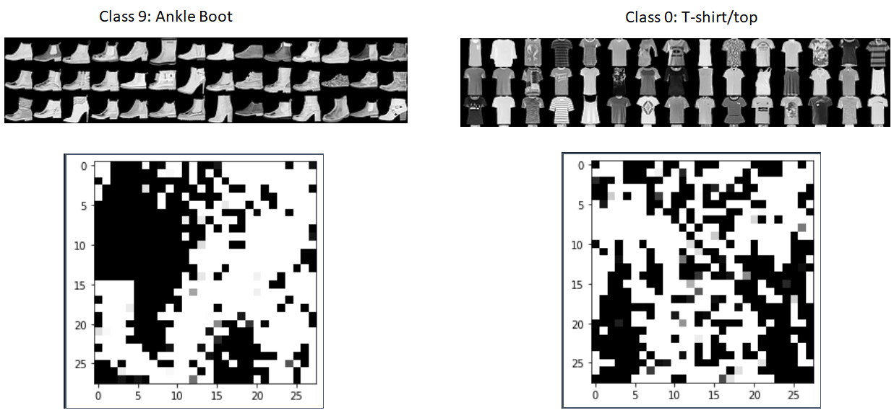

# Feature-Optimization
This is a simple code for visual analysis of a neural network which is also known as feature maximization or activation maximization. The original code can be found [here](https://github.com/Hvass-Labs/TensorFlow-Tutorials)

The idea is to generate an image that maximizes the individual features of the neural network. The image is initialized with a small amount of random noise, and then gradually modified using the gradient of the given feature with respect to the input image.



# Dependency
The code does not work with TensorFlow v.2. The TF version 1.15.0 is used to run the code.

# Dataset
This project uses the [Fashion MNIST](https://github.com/zalandoresearch/fashion-mnist) dataset which contains 70,000 grayscale images in 10 categories. 


### Labels
Each training and test example is assigned to one of the following labels:

| Label | Description |
| --- | --- |
| 0 | T-shirt/top |
| 1 | Trouser |
| 2 | Pullover |
| 3 | Dress |
| 4 | Coat |
| 5 | Sandal |
| 6 | Shirt |
| 7 | Sneaker |
| 8 | Bag |
| 9 | Ankle boot |


## Installation and Running

There are two main functions integrated in the ```train.py```.
*  Model training by running the function ```model(X_train, Y_train, X_test, Y_test)```. The parameters such as the dataset ( X_train, Y_train, X_test, Y_test), learning rate, number of epochs and minibatch size can be specifed in this function. After training, the parameters (weights) will be saved into to the ```param.pkl``` file.

*  Feature optimization by runing ```model_load_param()```. This functon wil load the previous saved weights (```param.pkl```)  and learn to maximise the feature from this learned parameters. The param.pkl that obtained by training the model with 1500 epoch are provided in this page.


Note that users are expected to modify the corresponding files to correct path to work properly. Enjoy!

